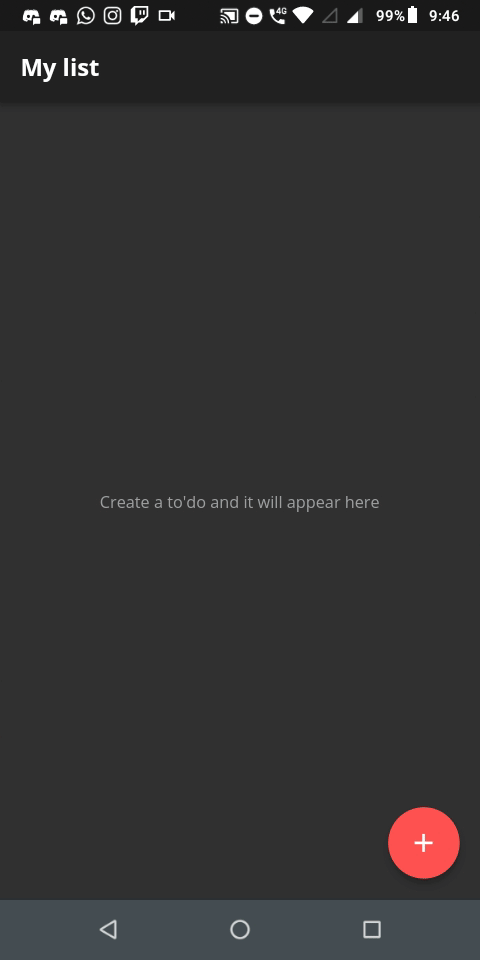

# Gerenciando o estado em uma aplicação Flutter

## Preview da aplicação

# Entendendo o conceito de _estado_

Vamos supor que estamos desenvolvendo uma aplicação que tem o objetivo de exibir uma lista de produtos de uma loja. Simplificando as entidades, cada produto tem um título, uma descrição e um valor. **Como implementamos a aplicação para guardar essas informações de uma lista? Através do estado!** Dessa forma, todas as variáveis que escrevemos são armazenadas na memória do nosso aplicativo.

> O estado não serve só para armazenar essas variáveis dos produtos, no caso. Ele também armazena as informações da nossa interface, assim como cada elemento nativo que está sendo exibido. Porém não precisamos nos preocupar com isso, especificamente, porque o Framework já faz esse trabalho para a gente.

Sendo assim, dentro de uma aplicação Flutter temos dois tipos de estados:

- ### Ephemeral State

  Também podemos chamar ele de _estado local_. Nele armazenamos as nossas varíaveis que dizem respeito a somente um widget específico e que não precisam ser compartilhadas com a aplicação inteira. Para atualizar algum valor, simplesmente precisamos chamar a função `setState` dentro do nosso `State<Widget>` e pronto, esse valor será alterado e toda nossa UI responderá a essa atualização, provocando uma nova renderização da tela.

- ### App State
  Também podemos chamar ele de _estado global_ ou _estado compartilhado_. Ele é o oposto do _Ephemeral_, já que neles armazenamos informações pertinentes a aplicação inteira e todos os Widgets podem acessar essas informações. Como exemplo tempos as preferências de um usuário, informações de Login e até mesmo o Carrinho do nosso eCommerce. Para implementar esse tipo de estado você precisa pesquisar especificamente um "padrão", digamos, de como podemos organizá-lo. Entre esses padrões, temos Redux, BloC, MobX, Provider, etc.

 

Vamos ressaltar algo importante sobre isso: **não existe uma regra que você deve seguir em TODOS as aplicações**. As coisas sempre dependem do que você precisa desenvolver. Mas, podemos seguir um fluxo de pensamento que nos dirá qual tipo de estado devemos implementar, seja um _Ephemeral_ ou um _App State_:

- Quem precisa do dado?
  - Muitos ou alguns Widgets: Então, provavelmente você precisa de um _App State_
  - Somente um Widget: Então, use um _Ephemeral_

 

# Implementando a aplicação utilizando Provider

## O que é Provider?

De maneira resumida, o Provider é uma biblioteca para o Flutter que nos auxilia na implementação de um _App State_ de maneira fácil, tanto para quem ainda está adentrando no mundo do desenvolvimento mobile quanto para quem já ultiliza ou ja ultilizou algum framework.

## Como funciona o Provider?

Vamos sair do exemplo do nosso eCommerce e partir para um exemplo de um _To'do list_, que é o aplicativo implementado nesse repositório e vamos dizer que ele é estruturao da seguinte forma:

- Página inicial, que exibe todos os to'dos;
- Página para criar um to'do;

Nesse caso, temos duas telas que implementam os seus próprios estados _Ephemeral_. Mas como podemos fazer com que o estado da página de criação de um todo seja refletido na página inicial? Ou seja, como adicionar um to'do sendo que ele está sendo criado em uma outra tela? Isso se torna mais fácil quando criamos um _App State_, que chamaremos de **model** agora, implementamos a nossa lista de to'do nele e as funções responsáveis por adicionar ou remover um to'do da lista. Após isso, fazemos com que tanto a página inicial e a página de criação **escutem** e **consumam** as atualizações desse nosso estado.
